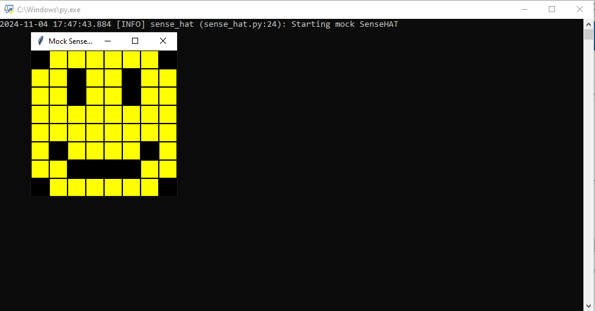

<style>

body {
    counter-reset: h2counter;
}

/* H1 - No numbering */
h1 {
    /* No counter reset or increment */
}

/* H2 - Level 1 numbering */
h2 {
    counter-reset: h3counter;
}

h2::before {
    counter-increment: h2counter;
    content: counter(h2counter) ". ";
}

/* H3 - Level 2 numbering */
h3 {
    counter-reset: h4counter;
}

h3::before {
    counter-increment: h3counter;
    content: counter(h2counter) "." counter(h3counter) " ";
}

/* H4 - Level 3 numbering (optional) */
h4 {
    counter-reset: h5counter;
}

h4::before {
    counter-increment: h4counter;
    content: counter(h2counter) "." counter(h3counter) "." counter(h4counter) " ";
}

</style>

# Evidence and Knowledge

This document includes instructions and knowledge questions that must be completed to receive a *Competent* grade on this portfolio task.

## Required evidence

### Answer all questions in this document

- Each answer should be complete, well-articulated, and within the specified word count limits (if added) for each question.
- Please make sure **all** external sources are properly cited.
- You must **use your own words**. Please include your full chat transcripts if you use generative AI in any way.
- Generative AI hallucinates, is not an authoritative source

### Make all the required modifications to the code

- Please follow the instructions in this document to make the changes needed to the code.

- When requested to upload evidence, upload all screenshots to `screenshots/` and embed them in this document. For example:

```markdown

```

- You must upload the code into your GitHub repository.
- While you can use a branch, your code should be in main when you submit.
- Upload a zip of this repository to Blackboard when you are ready to submit.
- You will be notified of your result via Blackboard
- However, if using GitHub classrooms, you may also receive additional feedback on GitHub directly

### Optional: Use of Raspberry Pi and SenseHat

Raspberry Pi or SenseHat is **optional** for this activity. You can use the included `sense_hat.py` file to simulate the SenseHat on your computer.

If you use a Pi, please **delete** the `sense_hat.py` file.

### Accessible version of the code

This project relies on visual patterns that appear on an LED matrix. If you have any accessibility requirements, you can use the `udl/accessible` branch to complete the project. This branch provides an accessible code version that uses text-based patterns instead of visual ones.

Please discuss this with your lecturer before using that branch.

## Specific Tasks & Questions

Address the following tasks and questions based on the code provided in this repository.

### Set up the project locally

1. Fork this repository (if not using GitHub Classrooms)
2. Clone your repository locally
3. Run the project locally by executing the `main.py` file
4. Evidence this by providing screenshots of the project directory structure and the output of the `main.py` file



If you are running on a Raspberry Pi, you can use the following command to run the project and then screenshot the result:

```bash
ls
python3 main.py
```

### Fundamental code comprehension

 Answer each of the following questions **as they relate to that code** supplied by in this repository (ignore `sense_hat.py`):

1. Examine the code for the `smiley.py` file and provide  an example of a variable of each of the following types and their corresponding values (`_` should be replaced with the appropriate values):

   | Type                    | name           | value          				|
   | ----------              | ----------     | -------------- 				|
   | built-in primitive type | dimmed         | true           				|
   | built-in composite type | self.pixels    | [(0,0,0), (255,255,0), etc] |
   | user-defined type       | self.sense_hat | SenseHat()             		|

2. Fill in (`_`) the following table based on the code in `smiley.py`:

   | Object                   | Type                    |
   | ------------             | ----------------------- |
   | self.pixels              | list                    |
   | A member of self.pixels  | tuple                   |
   | self                     | Smiley (class instance) |

3. Examine the code for `smiley.py`, `sad.py`, and `happy.py`. Give an example of each of the following control structures using an example from **each** of these files. Include the first line and the line range:

   | Control Flow | File       | First line  								 				   | Line range  |
   | ------------ | ---------- | ----------- 								 				   | ----------- |
   |  sequence    | smiley.py  | self.sense_hat = SenseHat()				 				   | 9-11        |
   |  selection   | happy.py   | self.pixels[pixel] = self.BLANK if wide_open else self.YELLOW | 31          |
   |  iteration   | sad.py     | for pixel in mouth:           								   | 13-15       |

4. Though everything in Python is an object, it is sometimes said to have four "primitive" types. Examining the three files `smiley.py`, `sad.py`, and `happy.py`, identify which of the following types are used in any of these files, and give an example of each (use an example from the code, if applicable, otherwise provide an example of your own):

   | Type                    | Used? | Example 																				|
   | ----------------------- | ----- | --------																				|
   | int                     | yes   | mouth = [49, 54, 42, 43, 44, 45] (list of integers in sad.py)                        |
   | float                   | yes   | delay=0.25 (used in happy.py to control blink delay)​          						|
   | str                     | No	 | (Not explicitly used, but could appear as text strings for drawing names or actions) |
   | bool                    | yes   | wide_open=True (boolean flag for eye state in sad.py and happy.py)​         		  	|

5. Examining `smiley.py`, provide an example of a class variable and an instance variable (attribute). Explain **why** one is defined as a class variable and the other as an instance variable.

> In smiley.py, the class variable and instance variable are:

Class variable: WHITE = (255, 255, 255)

Defined on line 3​(smiley).
Explanation: This is a class variable because it is shared across all instances of the Smiley class. The color constants like WHITE, GREEN, RED, etc., represent fixed values that are the same for every smiley face, 
regardless of individual instance. Class variables are used for values that do not change per instance and are shared across all instances of the class.

Instance variable: self.sense_hat = SenseHat()

Defined on line 10​(smiley).
Explanation: This is an instance variable because it is specific to each instance of the Smiley class. Each Smiley object will have its own sense_hat object to interact with the hardware. Instance variables are unique 
to each object, and in this case, each smiley may need to interact with its own SenseHat display, making sense_hat an attribute unique to each instance.
>

6. Examine `happy.py`, and identify the constructor (initializer) for the `Happy` class:
   1. What is the purpose of a constructor (in general) and this one (in particular)?

General purpose of a constructor: A constructor (in Python, defined using __init__) is a special method used to initialize a new instance of a class. It sets up the initial state of the object by assigning values to 
instance variables or running any required setup code. Each time a new object is created from a class, the constructor ensures the object is properly configured before it's used.

Purpose of the constructor in Happy: The constructor for the Happy class (found on line 7) initializes a new instance of Happy with specific features for a smiley face. In particular, it:

Calls the constructors of its parent classes (Smiley and Blinkable) to inherit their behaviors and properties.
It then calls two methods: draw_mouth() and draw_eyes(), which define how the happy smiley looks by setting pixel values for the mouth and eyes.
Thus, it ensures that a Happy object is correctly set up as a specialized version of a smiley face with specific visual features.
   >

   2. What statement(s) does it execute (consider the `super` call), and what is the result?

   > The key statement in the Happy constructor is the super().__init__() call, which is used to invoke the constructors of its parent classes (Smiley and Blinkable):
python
Copy code
super().__init__()
Execution:
super().__init__() ensures that the constructor of the Smiley class is called first. This initializes the sense_hat object (to control the hardware) and sets up the basic smiley pixels.
If there is any relevant setup in the Blinkable class (another parent), it will also be executed by this call.
Result:
The constructor from the Smiley class initializes the pixel array (self.pixels) and prepares the display hardware (self.sense_hat) for the smiley.
After this, the Happy class' constructor customizes the Happy object by calling self.draw_mouth() and self.draw_eyes() to render a happy expression.
In summary, the super() call ensures proper inheritance and initialization from the parent classes, and the specific methods like draw_mouth() add unique happy features to the smiley.
   >

### Code style

1. What code style is used in the code? Is it likely to be the same as the code style used in the SenseHat? Give to reasons as to why/why not:
   
> Code Style: The code follows the PEP 8 style guide, which is the standard Python code style convention. This is evident from the use of clear indentation, lowercase method names with underscores (e.g., draw_mouth()), and spaces around operators.

Is it likely to be the same as the code style used in the SenseHat?

Reason 1: Yes, it is likely the same because the SenseHat Python library is also developed using Python, and Python libraries typically adhere to PEP 8 standards. This ensures consistency and readability across Python 
codebases, especially for widely-used libraries like SenseHat.
Reason 2: Python’s community, including libraries like SenseHat, emphasizes PEP 8 as a universal style guide. Given that smiley.py, sad.py, and happy.py interact with SenseHat, it makes sense for the developer to 
follow similar conventions to align with the expected usage patterns and maintain readability.
>

2. List three aspects of this convention you see applied in the code.

> Use of lowercase with underscores for function/method names:
For example, methods like draw_mouth() and draw_eyes() follow this naming convention​(happy).
Spaces around operators:
In statements like self.pixels[pixel] = self.BLANK, spaces are placed around the assignment operator for readability​(sad)​(happy).
Class names in CamelCase:
Classes such as Happy, Sad, and Smiley follow the CamelCase convention for naming classes​(happy)​(sad)​(smiley).
>

3. Give two examples of organizational documentation in the code.

> Docstrings for methods:

Each method has a docstring explaining its purpose and parameters, such as:
python
Copy code
def draw_mouth(self):
    """
    Renders a mouth by blanking the pixels that form that object.
    """
This helps explain the functionality of methods like draw_mouth()​(happy).
Class-level documentation:

The Happy class includes a class-level docstring describing its overall purpose:
python
Copy code
class Happy(Smiley, Blinkable):
    """
    Provides a Smiley with a happy expression
    """
This gives an overview of the class's function​(happy).
>

### Identifying and understanding classes

> Note: Ignore the `sense_hat.py` file when answering the questions below

1. List all the classes you identified in the project. Indicate which classes are base classes and which are subclasses. For subclasses, identify all direct base classes.
  
  Use the following table for your answers:

| Class Name | Super or Sub? | Direct parent(s) 	  |
| ---------- | ------------- | ---------------- 	  |
| Smiley     | Super         | None    				  |
| Sad        | Sub           |      Smiley            |
| Happy      | Sub           |      Smiley, Blinkable |
| Blinkable  | Super         |      None              |

2. Explain the concept of abstraction, giving an example from the project (note "implementing an ABC" is **not** in itself an example of abstraction). (Max 150 words)

> Abstraction in programming refers to the concept of hiding complex implementation details and exposing only essential features of an object or a process. In this project, the Smiley class is an example of abstraction. 
It provides a high-level interface to create smiley faces with pixel arrays, while hiding the low-level details of how the pixel data is sent to the SenseHat hardware. By using methods like show() and dim_display(), 
users can interact with the display without needing to understand the internal workings of the SenseHat object. This abstraction simplifies the interaction for the developer, allowing them to focus on functionality rather 
than hardware details​(smiley).
>

3. What is the name of the process of deriving from base classes? What is its purpose in this project? (Max 150 words)

> The process of deriving from base classes is called inheritance. Its purpose in this project is to promote code reuse and specialization. For example, the Happy and Sad classes inherit common behavior from the Smiley 
base class. This allows the shared functionality of drawing a basic smiley face to be reused, while each subclass (like Happy) can add specific behaviors or modifications (such as different expressions) without duplicating 
the common code​(sad)​(happy).
>

### Compare and contrast classes

Compare and contrast the classes Happy and Sad.

1. What is the key difference between the two classes?
   > The key difference between the Happy and Sad classes is in how they draw the mouth of the smiley. The Happy class draws a happy smiley by using specific pixel positions to form an upward curved mouth, while the 
   Sad class uses different pixel positions to form a downward curved mouth, representing a sad expression​(happy)​(sad).
   >
2. What are the key similarities?
   > Both Happy and Sad are subclasses of Smiley, meaning they share the same base structure and functionality for drawing faces.
Both classes inherit and utilize methods from Smiley to draw the basic features of the smiley, such as the eyes.
They both override or extend the draw_mouth() and draw_eyes() methods to customize the expressions, but use the same underlying mechanism of manipulating the pixel array​(happy)​(sad).
   >
3. What difference stands out the most to you and why?
   > The most notable difference is the emotional representation of the smiley faces—Happy draws a smiling face, and Sad draws a frowning face. This stands out because it directly affects how the smiley is perceived, 
   changing its emotional tone. This difference is particularly impactful because the main purpose of these classes is to visually convey an emotion via pixel manipulation, and this single modification in the mouth's 
   shape is key to altering the mood.
   >
4. How does this difference affect the functionality of these classes
   > The difference in how the mouth is drawn affects the overall visual output of the classes. While both create a smiley face, the Happy class produces a positive, joyful expression, whereas the Sad class produces a 
   negative, sorrowful expression. This functional difference allows the two classes to represent different emotional states while using the same base class (Smiley) and methods for other shared functionalities like eye 
   movement or display dimming. The change in mouth rendering is the defining factor in expressing the emotional intent of each class​(happy)​(sad).
   >

### Where is the Sense(Hat) in the code?

1. Which class(es) utilize the functionality of the SenseHat?
   > The Smiley class directly utilizes the functionality of the SenseHat. Since both Happy and Sad inherit from Smiley, they also indirectly utilize the SenseHat functionality through their inherited 
   methods​(smiley)​(happy)​(sad).
   >
2. Which of these classes directly interact with the SenseHat functionalities?
   > The Smiley class directly interacts with the SenseHat functionalities. It creates an instance of the SenseHat in its constructor (self.sense_hat = SenseHat()) and uses it to manipulate the pixel 
   display through methods like show() and dim_display()​(smiley).
   >
3. Discuss the hiding of the SenseHAT in terms of encapsulation (100-200 Words)
   > Encapsulation is a fundamental object-oriented principle where the internal workings of a class are hidden from outside access, exposing only what is necessary to interact with the object. In this project, the SenseHat 
   is encapsulated within the Smiley class. The sense_hat object is initialized inside the constructor of Smiley, and its direct interaction with hardware is hidden from the other parts of the code. Instead of exposing 
   the SenseHat object, the class provides methods like show() and dim_display() for interacting with the LED matrix display. These methods abstract away the complexity of working with the SenseHat, making the code simpler 
   and more modular. Users of the Smiley, Happy, or Sad classes don't need to know how the hardware operates; they can simply call these methods to achieve their desired outcomes​(smiley). This level of encapsulation ensures 
   that changes to the internal workings of the SenseHat can be managed without affecting other parts of the system.

### Sad Smileys Can’t Blink (Or Can They?)

Unlike the `Happy` smiley, the current implementation of the `Sad` smiley does not possess the ability to blink. Let's first explore how blinking has been implemented in the Happy Smiley by examining the blink() method, which takes one argument that determines the duration of the blink.

**Understanding Blink Mechanism:**

1. Does the code's author believe that every `Smiley` should be able to blink? Explain.

> No, the code’s author does not believe that every Smiley should be able to blink. This is evident because the blinking functionality is not implemented in the base Smiley class. Instead, the blinking behavior is 
introduced in the Happy class, which also inherits from Blinkable. The absence of a blink() method in the Smiley class suggests that blinking is considered a specialized behavior, not a universal feature of all 
smileys​(happy)​(smiley).
>

2. For those smileys that blink, does the author expect them to blink in the same way? Explain.

>  Yes, for those smileys that blink, the author expects them to blink in the same way. The Happy class provides a blink() method that defines how a smiley should blink—by drawing the eyes closed, waiting for a delay, 
and then reopening them. Since the blinking behavior is centralized in the Blinkable class and used by the Happy class, this method likely applies the same blinking mechanism to any smiley that inherits and implements 
it​(happy).
>

3. Referring to the implementation of blink in the Happy and Sad Smiley classes, give a brief explanation of what polymorphism is.

> Polymorphism allows different classes to implement the same method in a way that is specific to their behavior. In this context, if the Sad smiley were to implement a blink() method, both Happy and Sad smileys could "blink" 
but in potentially different ways. Polymorphism would enable the blink() method to behave appropriately for each class. For example, while the Happy smiley already blinks by closing and opening its eyes, the Sad smiley could 
implement a slightly different version of blink(), such as blinking at a different speed or in a different style​(happy).
>

4. How is inheritance used in the blink method, and why is it important for polymorphism?

>  Inheritance is used in the blink() method by allowing the Happy class to inherit behaviors from both Smiley and Blinkable. The Happy class overrides certain methods (like drawing the eyes) to customize its behavior but 
reuses the common interface for interacting with the SenseHat display. This inheritance is crucial for polymorphism because it allows different smileys (e.g., Happy and potentially Sad) to share a common interface 
(e.g., blink()) while implementing it in their own way. Polymorphism is enabled because classes that inherit from the same base class or interface can be treated uniformly while still behaving differently when their specific 
implementations are invoked​(happy)​(smiley).
>
1. **Implement Blink in Sad Class:**

   - Create a new method called `blink` within the Sad class. Ensure you use the same method signature as in the Happy class:

   ```python
   def blink(self, delay=0.25):
       pass  # Replace 'pass' with your implementation
   ```

2. **Code Implementation:** Implement the code that allows the Sad smiley to blink. Use the implementation from the Happy Smiley as a reference. Ensure your new method functions similarly by controlling the blink duration through the `delay` argument.

3. **Testing the Implementation:**

- Test the new blink functionality on your Raspberry Pi or within the Python classes provided. You might need to adjust the `main.py` script to incorporate Sad Smiley's new blinking capability.

Include a screenshot of the sad smiley or the modified `main.py`:


- Observe and document the Sad smiley as it blinks its eyes. Describe any adjustments or issues encountered during implementation.

  > Your answer here

  ### If It Walks Like a Duck…

  Previously, you implemented the blink functionality for the Sad smiley without utilizing the class `Blinkable`. Assuming you did not use `Blinkable` (even if you actually did), consider how the Sad smiley could blink similarly to the Happy smiley without this specific class.

  1. **Class Type Analysis:** What kind of class is `Blinkable`? Inspect its superclass for clues about its classification.

     > Your answer here

  2. **Class Implementation:** `Blinkable` is a class intended to be implemented by other classes. What generic term describes this kind of class, which is designed for implementation by others? **Clue**: Notice the lack of any concrete implementation and the naming convention.

  > Your answer here

  3. **OO Principle Identification:** Regarding your answer to question (2), which Object-Oriented (OO) principle does this represent? Choose from the following and justify your answer in 1-2 sentences: Abstraction, Polymorphism, Inheritance, Encapsulation.

  > Your answer here

  4. **Implementation Flexibility:** Explain why you could grant the Sad Smiley a blinking feature similar to the Happy Smiley's implementation, even without directly using `Blinkable`.

  > Your answer here

  5. **Concept and Language Specificity:** In relation to your response to question (4), what is this capability known as, and why is it feasible in Python and many other dynamically typed languages but not in most statically typed programming languages like C#? **Clue** This concept is hinted at in the title of this section.

  > Your answer here

  ***

  ## Refactoring

  ### Does a Smiley Have to Be Yellow?

  While our current implementation predominantly features yellow smileys, emotional expressions like sickness or anger typically utilize colors like green, red, or orange. We'll explore the feasibility of integrating these colors into our smileys.

  1. **Defined Colors and Their Location:**

     1. Which colors are defined and in which class(s)?
        > Your answer here
     2. What type of variables hold these colors? Are the values expected to change during the program's execution? Explain your answer.
        > Your answer here
     3. Add the color blue to the appropriate class using the appropriate format and values.

  2. **Usage of Color Variables:**

     1. In which classes are the color variables used?
        > Your answer here

  3. **Simple Method to Change Colors:**
  4. What is the easiest way you can think to change the smileys to green? Easiest, not necessarily the best!
     > Your answer here

  Here's a revised version of the "Flexible Colors – Step 1" section for the smiley project, incorporating your specifications for formatting and content updates:

  ### Flexible Colors – Step 1

  Changing the color of the smileys once is straightforward, but it isn't very flexible. To facilitate various colors for smileys, it is advisable not to hardcode values in any class. This approach was identified earlier as a necessary change. Let's start by removing the built-in assumptions about color in our classes.

  1. **Add a method called `complexion` to the `Smiley` class:** Implement this instance method to return `self.YELLOW`. Using the term "complexion" instead of "color" provides a more abstract terminology that focuses on the meaning rather than implementation.

  2. **Refactor subclasses to use the `complexion` method:** Modify any subclass that directly accesses the color variable to instead utilize the new `complexion` method. This ensures that color handling is centralized and can be easily modified in the future.

  3. **Determine the applicable Object-Oriented principle:** Consider whether Abstraction, Polymorphism, Inheritance, or Encapsulation best applies to the modifications made in this step.

  4. **Verify the implementation:** Ensure that the modifications function as expected. The smileys should still display in yellow, confirming that the new method correctly replaces the direct color references.

  This step is crucial for setting up a more flexible system for color management in the smiley display logic, allowing for easy adjustments and extensions in the future.

  ### Flexible Colors – Step 2

  Having removed the hardcoded color values, we now enhance the base class to support dynamic color assignments more effectively.

  1. **Modify the `__init__()` method in the `Smiley` class:** Introduce a default argument named `complexion` and assign `YELLOW` as its default value. This allows the instantiation of smileys with customizable colors.

  2. **Introduce a new instance variable:** Create a variable called `my_complexion` and assign the `complexion` parameter to it. This step ensures that each smiley instance can maintain its own color state.

  3. **Rationale for `my_complexion`:** Using a distinct instance variable like `my_complexion` avoids potential conflicts with the method parameter names and clarifies that it is an attribute specific to the object.

  4. **Bulk rename:** We want to update our grid to use the value of complexion, but we have so many `Y`'s in the grid. Use your IDE's refactoring tool to rename all instances of the **symbol** `Y` to `X`. Where `X` is the value of the `complexion` variable. Include a screenshot evidencing you have found the correct refactor tool and the changes made.

  

  5. **Update the `complexion` method:** Adjust this method to return `self.my_complexion`, ensuring that whatever color is assigned during instantiation is what the smiley displays.

  6. **Verification:** Run the updated code to confirm that Smileys still defaults to yellow unless specified otherwise.

  ### Flexible Colors – Step 3

  With the foundational changes in place, it's now possible to implement varied smiley colors for different emotional expressions.

  1. **Adjust the `Sad` class initialization:** In the `Sad` class's initializer method, change the superclass call to include the `complexion` argument with the value `self.BLUE`, as shown:

     ```python
     super().__init__(complexion=self.BLUE)
     ```

  2. **Test color functionality for the Sad smiley:** Execute the program to verify that the Sad smiley now appears blue.

  3. **Ensure the Happy smiley remains yellow:** Confirm that changes to the Sad smiley do not affect the default color of the Happy smiley, which should still display in yellow.

  4. **Design and Implement An Angry Smiley:** Create an Angry smiley class that inherits from the `Smiley` class. Set the color of the Angry smiley to red by passing `self.RED` as the `complexion` argument in the superclass call.

  ***
